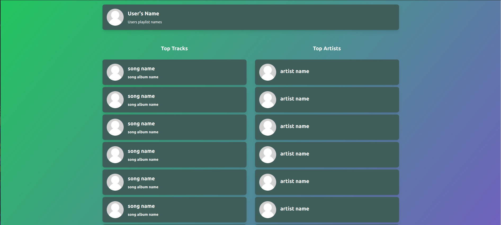

## YourSpotiftTops
Simple React.js app that shows your top artists and tracks from Spotify.

## How to run
1. Clone this repo
```bash
git clone https://github.com/Mahhheshh/YourSpotiftTops.git
```
2. Go to the project directory
```bash
cd YourSpotiftTops
```
3. Run `npm install`
4. Run `npm start dev`
5. Go to `https://localhost:5173`


### preview
